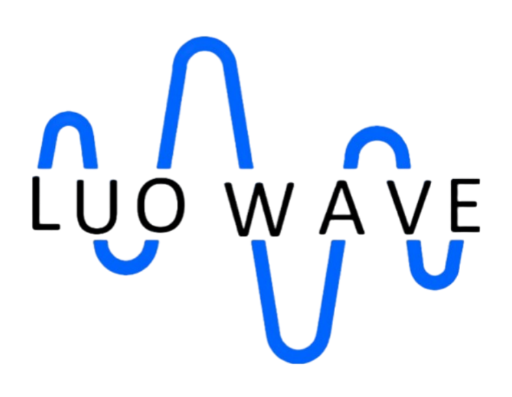
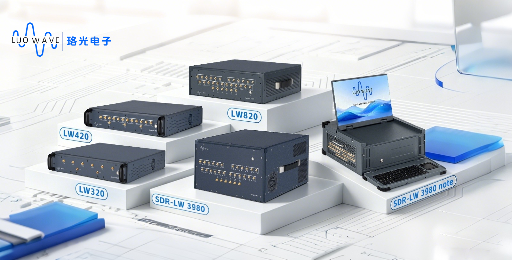
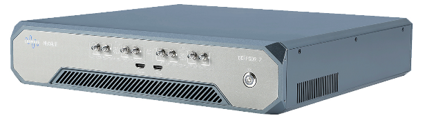

# Luowave

### Software Defined Radio & Counter-UAS Solutions

Advanced SDR platforms, intelligent radio systems, drivers, and developer resources.

[Official Website](https://www.luowave.com/en/) · [Product Documentation](https://github.com/SoftwareTeamLW/product-docs) · [All Repositories](https://github.com/orgs/SoftwareTeamLW/repositories)

---

## About Luowave

Luowave develops software-defined radio platforms and supporting technologies for wireless communications, spectrum monitoring, research, education, and intelligent RF applications.

Our public repositories provide a structured home for product documentation, platform software, shared drivers, integration examples, and future open-source releases.

## Products

### General-Purpose SDR Platforms

- [**LW320**](https://github.com/SoftwareTeamLW/lw-320) — 2T2R coherent SDR platform for wireless communications, radar, satellite communications, MIMO, and direction-finding applications.
- [**LW420**](https://github.com/SoftwareTeamLW/lw-420) — 4T4R coherent SDR platform for multi-channel wireless communications, radar, MIMO, and phase-coherent RF applications.
- [**LW820**](https://github.com/SoftwareTeamLW/lw-820) — 8T8R coherent SDR platform for large-scale multi-channel systems, phased-array applications, radar, MIMO, and advanced wireless research.

### Intelligent SDR Platforms

- [**DEEPSDR 2**](https://github.com/SoftwareTeamLW/deepsdr-2) — Software, acceleration resources, documentation, and deployment examples for the DEEPSDR 2 intelligent SDR platform.

## Developer Resources

- [**Luowave Driver**](https://github.com/SoftwareTeamLW/lw-driver) — Shared host drivers and APIs for Luowave SDR platforms.
- [**Product Documentation**](https://github.com/SoftwareTeamLW/product-docs) — Product manuals, data sheets, application notes, compatibility information, and release documentation.

## Repository Status

The public repository framework is now in place. Product software, firmware, examples, and approved documentation will be published progressively after review.

---

For product information and solutions, visit [www.luowave.com](https://www.luowave.com/en/).
